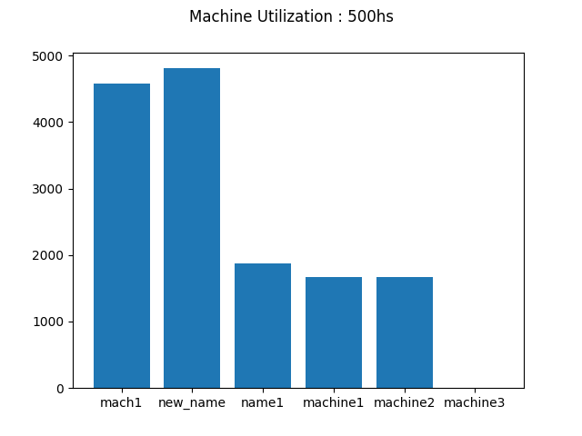

## Set up

```bash
$ git clone https://github.com/MadRajib/simulation_software.git
$ cd simulation_software

$ pip3 install -r requirements.txt 

$ python3 bin/simulation.py

Welcome To Machinery Simulation!
Loading Modules...

Please Enter Commands

```

type help :

```bash
Please Enter Commands
help

Help :
* Add Machinery details to the system:
    
    add mc <Categeory name, Quantity, MTTF Value >

* Add Adjuster details to the system :
    add ad <expertise machine>

* Update Categories details in the system :
    update mc < Category name, new name,new value, new value >

* Delete categories from the system :
    
    del mc <Category name>

* Update Adjuster details in the system :
    
    update ad < adjuster id, add or remove = [list of expertise machines]

* Delete Adjuster from the system :
    
    del ad <Adjuster id>

* Simulate the process :

    simulate 

* Show past results :

    show results 
    show results number=n #show last n records

* Reset the software :
    reset


Please Enter Commands
```

Examples:

1. Add machine category
```bash
Please Enter Commands
add mc name1 10 16

Category Added, success_code 3
```

2. Add adjuster
```bash
Please Enter Commands
add ad name1
```
3. Simulate
```bash
Please Enter Commands
simulate
```

```bash
Welcome To Machinery Simulation!
Loading Modules...

Please Enter Commands
add mc machine1 10 15
Category Added, success_code 4

Please Enter Commands
add mc machine2  20 12       
Category Added, success_code 5

Please Enter Commands
add mc machine3 30 10
Category Added, success_code 6

Please Enter Commands
add adjuster1 machine1
Error: Invalid Option! - >  adjuster1


Please Enter Commands
add ad adjuster1 machine1
Adjuster Added, success_code(id): 2

Please Enter Commands
add ad adjuster2 machine2
Adjuster Added, success_code(id): 3

Please Enter Commands
add add adjuster3 machine3
Error: Invalid Option! - >  add


Please Enter Commands
add ad adjuster3 machine3    
Adjuster Added, success_code(id): 4

Please Enter Commands
add ad adjuster4 machine3
Adjuster Added, success_code(id): 5

Please Enter Commands
simulate
```
